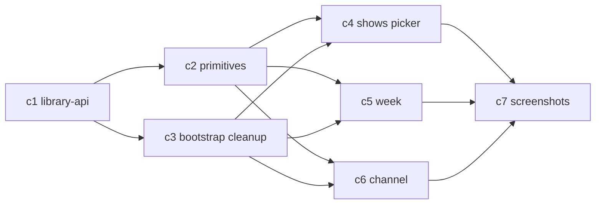

# Cursor Picker UI — Phase 1 Plan

Owner: Cursor
Branch: `v2-rebuild`
HEAD: `72026b7`
Scope: [/shared/acceptance/picker-ui.md](/C:/dev/mychannel-universal/shared/acceptance/picker-ui.md)
Status: Phase 2 approved. Amended 2026-04-23 per Al review (see §Amendments at bottom for change log).

Ground rules consumed from [/shared/HANDOFF-TO-CURSOR.md](/C:/dev/mychannel-universal/shared/HANDOFF-TO-CURSOR.md), [/shared/INTERFACES.md](/C:/dev/mychannel-universal/shared/INTERFACES.md), [/shared/CACHE.md](/C:/dev/mychannel-universal/shared/CACHE.md), [/shared/types.ts](/C:/dev/mychannel-universal/shared/types.ts), [/shared/V1.5-TECH-DEBT.md](/C:/dev/mychannel-universal/shared/V1.5-TECH-DEBT.md).

Frozen files (will not touch):

- `/api/**`
- `/data/**`
- `/shared/**` (except this plan + amendment-triggered edits to `V1.5-TECH-DEBT.md`)
- `app/src/state/store.ts`
- `app/src/lib/scheduler.ts`
- `app/src/lib/deep-link.ts`
- `/shared/types.ts` (PersistedTitle widening is client-side only in `app/src/types.ts`)

In scope (will touch):

- `app/src/screens/shows.ts`, `week.ts`, `channel.ts`, plus new `slot-edit.ts`.
- `app/src/router.ts` (amendment 4 — new `/slot-edit/:slotId` route, lands in c3).
- `app/src/main.ts` (c3 — drop catalogue loader).
- `app/src/types.ts` (c4 — add `PersistedTitleClient`).
- `app/src/screens/preview.ts`, `scheduling.ts`, `shows-tab.ts` (amendment 3 — rewire off `ctx.catalogue`, land in c3).
- `app/src/components/` — new primitives.
- `app/src/lib/library-api.ts`, `library-cache.ts`, `channel-adapter.ts` — new.

---

## 1. Screen architecture

### 1.1 `app/src/screens/shows.ts` (the picker)

Rebuilt as the live-library picker. Three reachable modes, same file:

- `wizard/shows` (onboarding step)
- `shows-picker` (return user "Add titles")
- Replaces the legacy `ctx.catalogue` path entirely.

Component breakdown (each a pure lit-html render fn in `app/src/screens/shows.ts` unless it is reusable, in which case it moves to `app/src/components/`):

- Top bar (existing `<mc-top-bar>`).
- Filter bar: search input (debounced), type toggle movie/tv/all, genre chip row, provider chip row (multi-select).
- Counter row: "X selected · min 6" + Continue/Done button.
- Results grid: windowed poster grid (see §3).
- Loading skeletons (bottom of grid during page fetch).
- Empty-state panel (single component, variant prop: `no-providers | no-results | no-filters | api-error`).
- Footer CTA (Continue for wizard, Done for tab-return).

State management:

- Global store (`app/src/state/store.ts`) remains the source of truth for `selectedTitles`, `streamers`, `region`.
- Screen-local state (module-scoped `let` plus a `screenState` record) holds: `items: LibraryTitle[]`, `page: number`, `totalPages: number`, `isLoading: boolean`, `error: string | null`, `filters: { query, genre, type, providers }`, `scrollOffset: number`.
- Screen-local filter state is mirrored to `localStorage` (amendment 2) under `mc_picker_filters_v2` on every mutation so filters survive app kill, not just reload. Query, genre, and type all persist alongside `state.streamers`, which already persists via [app/src/state/store.ts](app/src/state/store.ts).
- `ctx.redraw()` is the only way the screen re-renders. Async fetches end with `ctx.redraw()`.
- Writes to `selectedTitles` go through `ctx.patch({ selectedTitles })`.

Routing boundaries:

- No new routes. `router.ts` still dispatches `wizard/shows` + `shows-picker` → `renderShows`.
- Wizard-mode and tab-mode differ only in the footer button label + post-click navigation (unchanged from today).

### 1.2 `app/src/screens/week.ts`

Rebuilt as an editable per-slot grid driven by `state.schedule` + `state.selectedTitles`.

Layout:

- 7-day × 4-band grid, same column structure used today in [app/src/screens/week.ts](/C:/dev/mychannel-universal/app/src/screens/week.ts).
- Each cell shows either the scheduled title's 16:9 thumb + title + start time, or an "+ Add" button if the slot is empty/disabled.
- Day-header row has a small "+" that opens the slot-create sheet preset to that day.

Per-slot edit UI: **dedicated full-screen route** at `/slot-edit/:slotId` (amendment 4). New file [app/src/screens/slot-edit.ts](app/src/screens/slot-edit.ts). Not a modal — smart-TV focus on modals is clumsy. `<mc-modal>` stays in the codebase for other uses; it does not participate in per-slot edit. Slot-edit screen contents:

- `<mc-top-bar>` with back button → `/week`.
- Title: `Edit {DayName} {HH:MM}`.
- Preview of current title (poster + name + year + provider badge).
- Tabs: `Swap` (grid of `state.selectedTitles`, tap to replace), `Off` (disable slot), `Remove` (drop the slot).
- Secondary: `Pick new title` → navigates to `shows-picker` with a return intent stashed in a session module (so after the picker writes a new title, returning to slot-edit still knows which slot we came from).
- Smart-TV focus model: initial focus lands on the `Swap` tab button. D-pad left/right cycles `Swap`→`Off`→`Remove`→`Pick new title`. D-pad down enters the currently-selected tab's content region. Back button returns to `/week`.
- Week grid scroll position preserved via a session-scoped module variable in [app/src/screens/week.ts](app/src/screens/week.ts) (`let weekScrollY = 0` captured on route-away, restored on route-return). No store write for transient scroll.

Routing: router.ts is **no longer in the frozen list** — it must gain a `/slot-edit/:slotId` case. The edit lands in c3 (bootstrap cleanup) so lane-2 screen agents never touch it.

Mutations (unchanged from earlier draft — modal vs full-screen doesn't change the writes):

- Swap: `patch({ schedule: mapReplaceTitleId(slot.id, newTitleId), channel: rebuildChannel(...) })`.
- Off (disable): `patch({ schedule: mapSetEnabled(slot.id, false), channel: rebuildChannel(...) })`.
- Remove: `patch({ schedule: filterOut(slot.id), channel: rebuildChannel(...) })`.
- Add (from week grid's day-header "+"): `patch({ schedule: [...schedule, newSlot], channel: rebuildChannel(...) })`.

`rebuildChannel` is a **thin caller-side adapter**, not an edit to [app/src/lib/scheduler.ts](app/src/lib/scheduler.ts). It exists because `hydrateChannel` uses `titles[index % titles.length]` ([app/src/lib/scheduler.ts](app/src/lib/scheduler.ts) L40-41) which ignores `slot.titleId`. Without an adapter, a per-slot swap would not be reflected in the hydrated channel. The adapter pre-orders titles to slot order before calling `hydrateChannel`, exploiting the index-based pick to land the right title in each slot. See §4 walkthrough for the exact code. This is a workaround; promoting a `titleId`-aware path into `scheduler.ts` is logged as a V1.5 debt item.

No-reshuffle guarantee: mutations write to a single `ScheduleEntry` keyed by `slot.id`. The old behaviour in [app/src/screens/week.ts](/C:/dev/mychannel-universal/app/src/screens/week.ts) that rebuilds the full schedule via `buildSchedule(shows, slots)` on every toggle is deleted. Only the toggled slot changes.

### 1.3 `app/src/screens/channel.ts`

Rebuilt as a pure consumer of `hydrateChannel(schedule, selectedTitles, streamers)` from [app/src/lib/scheduler.ts](/C:/dev/mychannel-universal/app/src/lib/scheduler.ts). It no longer depends on `Show[]` or `app/src/lib/channel-hero.ts`.

- Hero: pick first `ScheduledProgram` where `now ∈ [slot start, slot end]` → "NOW". Else pick earliest future occurrence → "UP NEXT". Else empty-state.
- Up-next strip: next 4 programs after hero.
- Today's lineup: all programs whose `dayOfWeek === today.getDay()`.
- Watch button: resolves via `ScheduledProgram.searchUrls` (already generated by scheduler + deep-link) and calls the existing `launchShow`-equivalent path. No new deep-link code.

New helper (keep local to `channel.ts`, not a new module unless it grows):

- `computeHeroFromPrograms(programs: ScheduledProgram[], now: Date): HeroState<ScheduledProgram>`.

Old [app/src/lib/channel-hero.ts](/C:/dev/mychannel-universal/app/src/lib/channel-hero.ts) stays for now because `preview.ts` and `scheduling.ts` still import it. It will be deleted in v1.5 cleanup, not this pass — adding to [/shared/V1.5-TECH-DEBT.md](/C:/dev/mychannel-universal/shared/V1.5-TECH-DEBT.md) on commit.

### 1.4 Shared UI primitives to extract

Under `app/src/components/`:

- `library-card.ts` → `<mc-library-card>`: LibraryTitle-aware poster tile with provider badges overlay, selected state, tap target. Supersedes `poster-card.ts` for library use; keep `poster-card.ts` alive for legacy screens.
- `provider-badges.ts` → `<mc-provider-badges>`: horizontal row of logo chips from `ProviderBadge[]`. Max 3 visible + `+N`.
- `skeleton-tile.ts` → `<mc-skeleton-tile>`: shimmer placeholder sized exactly like `<mc-library-card>` so the grid doesn't jump on load.
- `empty-state.ts` → `<mc-empty-state>`: single panel, variant attribute. Handles all four picker empty cases + week empty + channel empty.
- `filter-bar.ts` → `<mc-filter-bar>`: search input + genre chip row + provider chip row. Fires `mc-filter-change` with `{query, genre, providers, type}`.

Router, store, deep-link, scheduler: untouched.

---

## 2. Data flow

### 2.1 New module: `app/src/lib/library-api.ts`

Single typed client consuming the Codex backend. Signatures:

```ts
fetchLibrary(filters: LibraryFilters & { page: number }): Promise<LibraryResponse>
fetchProviders(region?: Region): Promise<LibraryProvidersResponse>
fetchTitle(tmdbType: TmdbTitleType, tmdbId: number): Promise<TitleResponse>
fetchTitleProviders(tmdbType: TmdbTitleType, tmdbId: number, region: Region): Promise<TitleProvidersResponse>
```

All consume types from `shared/types.ts` via the existing `app/src/types.ts` re-export. Base URL from `shared/constants.ts` (`API_BASE = '/api'`).

### 2.2 Per-screen request matrix

- Picker (`shows.ts`):
  - On mount: `fetchProviders(region)` once per session (cached in `libraryCache`).
  - On filter change (incl. search debounce 250ms): reset `page = 1`, call `fetchLibrary({page:1, ...filters})`.
  - On scroll sentinel intersect: `fetchLibrary({page:page+1, ...filters})`, append items.
- Week (`week.ts`): no network. Reads `selectedTitles` + `schedule` from store.
- Channel (`channel.ts`): no network. Reads `channel` (hydrated `ScheduledProgram[]`) from store.

### 2.3 Pagination + infinite scroll trigger

- `IntersectionObserver` on a `<div data-sentinel>` 600px below the last rendered tile (bottom margin in `rootMargin: '0px 0px 600px 0px'`).
- Debounced to 1 concurrent in-flight request; the observer `unobserve`s while loading and re-observes when done.
- Stop when `page >= totalPages`.

### 2.4 Search + genre filter → query params and persistence

- Search box → `?query=<string>`. When non-empty, genre/type/providers still pass through on the URL; backend chooses search vs discover (per [api/library.ts](/C:/dev/mychannel-universal/api/library.ts) L155-158).
- Genre chips → single-select `?genre=<GenreId>`. Backend pass-through per [/shared/acceptance/backend-api.md](/C:/dev/mychannel-universal/shared/acceptance/backend-api.md) L20.
- Type toggle → `?type=movie|tv|all`.
- Provider chips → `?providers=<csv>`, default-seeded from `state.streamers` and editable on the picker screen. Changes write back to `state.streamers` via `ctx.patch`.

Persistence (amendment 2): `query + genre + type` persist via `localStorage` key `mc_picker_filters_v2`. `providers` already persists in `state.streamers` via the store. The picker's module-scoped `screenState` hydrates from localStorage on first render and writes back on every filter mutation. Survives reload, app background, app kill.

### 2.5 Error / retry / offline

- On fetch rejection or `response.success === false`: set `screenState.error = error.message`, show `<mc-empty-state variant="api-error">` with a Retry button.
- Retry does one more attempt; on second failure we keep the error state and expose "Report to /shared/BLOCKERS.md" messaging in dev builds only.
- No automatic exponential backoff. Silent retry loops hide real breakage. The user sees a button.
- Offline: the standard fetch rejection path handles it. No Service Worker work in this pass.

### 2.6 Client-side cache layer

One module: `app/src/lib/library-cache.ts`. In-memory Map, app-session lifetime, no localStorage (per [/shared/CACHE.md](/C:/dev/mychannel-universal/shared/CACHE.md)):

- `providersByRegion: Map<Region, StreamerManifest[]>` — never evicted within session.
- `libraryPages: Map<string, LibraryResponse>` where key is `hashFilters({region, providers, genre, query, type, page})`. Cap 32 entries (LRU).
- `titleDetails: Map<string, TitleDetail>` cap 64 entries.

No persisted-to-disk caching. Backend already has 24h TTL (see [/shared/CACHE.md](/C:/dev/mychannel-universal/shared/CACHE.md) L14-19). My client cache is purely for UX snappiness when users re-open the picker mid-session.

---

## 3. Virtualization strategy

Back-of-envelope before picking an approach:

- Library size: up to 500 pages × 40 items = 20,000 tiles.
- Page 1 is ~40 items. Typical user scrolls 3-6 pages deep. Worst case I plan for: 10 pages (400 tiles) in a warm session.
- Poster tile = 2:3 image + caption + badges row ≈ 320-360px tall.
- Columns: `auto-fill, minmax(160px, 1fr)` ⇒ iPhone 390px → 2 cols, iPad 820px → 5 cols, laptop 1440px → 8 cols, smart-TV 1920px → 11 cols. Cap at 6 cols on TV for readable tile size (`max-width 240px` per tile).
- Worst case rendered at once without virtualization: 400 tiles × `contain: content` ≈ ~55MB DOM. That's too much on phones.

**Chosen approach: CSS `content-visibility: auto` + row-level `IntersectionObserver` windowing**. Two lines of defense:

1. First line: every grid row wrapper gets `content-visibility: auto; contain-intrinsic-size: auto 360px`. iOS 16+/modern Chromium/smart-TV browsers will skip paint+layout for off-screen rows. This alone handles 400-tile sessions on laptop/TV.
2. Second line (phone/older Safari): hard window of `MAX_LIVE_ROWS = 40` (≈ phone: 80 tiles / TV: 240 tiles). Rows below the window are replaced with a single spacer `<div style="height: nRows × rowHeight">`, same for above-window rows when the user scrolls deep.

Measurement:

- `ResizeObserver` on the first rendered row writes `rowHeight` (and `colsPerRow`) to a module-scoped variable.
- Spacer heights recompute when `rowHeight` changes. Re-layout on window resize.

Numbers (laptop 1440px, 6 cols):

- tile height ≈ 340px (poster 240px + caption 60px + badges 40px).
- rendered window = 40 rows × 6 cols = 240 tiles ≈ 13,600px scroll.
- Above/below spacer divs carry the rest.

Numbers (iPhone 390px, 2 cols):

- tile height ≈ 320px.
- rendered window = 40 rows × 2 cols = 80 tiles ≈ 12,800px scroll.

Trade-off I am accepting: true pixel-perfect smooth deep-scroll. I'm not shipping lit-virtualizer because (a) it adds a dep, (b) picker-ui.md says "virtualized poster grid" not "sub-frame scroll parity". If Al rejects this trade-off, the fallback is lit-virtualizer (`@lit-labs/virtualizer`) — I flag that as a decision to reopen only on his word.

---

## 4. Per-slot edit semantics — walkthrough

Amended per amendment 4 — modal replaced with full-screen route.

User is on `#/week`. Schedule has 12 slots across the week. User taps Tuesday 20:00 (`slot.id = 'slot-2-20:00'`, currently showing "Breaking Bad").

1. `click(slot)` fires. Week screen captures `weekScrollY = window.scrollY` in a module-scoped variable, then `ctx.navigate('slot-edit/slot-2-20:00')`.
2. Router matches `/^slot-edit\/(.+)$/`, extracts `slotId`, dispatches to `renderSlotEdit(ctx, slotId)` in the new file [app/src/screens/slot-edit.ts](app/src/screens/slot-edit.ts).
3. `renderSlotEdit` renders full-screen. Initial focus programmatically lands on the "Swap" tab button (smart-TV D-pad). Swap tab content is a grid of `state.selectedTitles` with the current `titleId` pre-marked.
4. User selects "Dune: Part Two". Handler computes the mutation:

   ```ts
   const nextSchedule = state.schedule.map(s =>
     s.id === slotId
       ? { ...s, titleId: newTitleId, showId: newTitleId, endTime: computeEndTime(s, newTitle) }
       : s
   );
   const nextChannel = rebuildChannel(nextSchedule, state.selectedTitles, state.streamers);
   await ctx.patch({ schedule: nextSchedule, channel: nextChannel });
   ctx.navigate('week');
   ```

5. `rebuildChannel` is a caller-side adapter, NOT an edit to scheduler.ts:

   ```ts
   // app/src/lib/channel-adapter.ts (new, c5 or c6 commit)
   import { hydrateChannel } from './scheduler';
   import type { PersistedTitle, ScheduleEntry, ScheduledProgram, StreamerId } from '../types';

   export function rebuildChannel(
     schedule: ScheduleEntry[],
     selectedTitles: PersistedTitle[],
     selectedProviders: StreamerId[],
   ): ScheduledProgram[] {
     const enabled = schedule
       .filter(s => s.enabled)
       .slice()
       .sort((l, r) =>
         l.dayOfWeek !== r.dayOfWeek
           ? l.dayOfWeek - r.dayOfWeek
           : l.startTime.localeCompare(r.startTime),
       );
     const titleById = new Map(selectedTitles.map(t => [t.id, t]));
     const slotOrderedTitles: PersistedTitle[] = enabled
       .map(s => s.titleId && titleById.get(s.titleId))
       .filter((t): t is PersistedTitle => Boolean(t));
     // hydrateChannel's titles[index % titles.length] now picks slotOrderedTitles[index],
     // matching the sorted-slot order exactly. scheduler.ts is untouched.
     return hydrateChannel(schedule, slotOrderedTitles, selectedProviders);
   }
   ```

   When every enabled slot has a bound `titleId`, `slotOrderedTitles.length === enabledSlots.length` and the round-robin index never wraps — each slot gets its bound title. When a slot has no titleId (legacy state), it is dropped from both arrays in sync, which matches the current behaviour of "no title → no channel entry".

6. `computeEndTime` in slot-edit screen:

   ```ts
   function computeEndTime(slot: ScheduleEntry, title: PersistedTitleClient): string {
     const runtime = title.runtimeMinutes ?? null;
     if (runtime == null) return slot.endTime; // keep existing band-window end
     return clampEndToWindow(slot.startTime, slot.endTime, runtime);
   }
   ```

   `clampEndToWindow` is not exported from scheduler.ts today. Three options:
   - Reimplement the 3-line function inline in slot-edit.ts (my pick — zero frozen-file risk).
   - Export it from scheduler.ts (scheduler edit; blocked).
   - Duplicate into a new `app/src/lib/slot-edit-utils.ts`.

   Picking the inline copy. It's 5 lines, identical math. Noted as v1.5 debt to de-dupe if scheduler.ts becomes un-frozen.

7. `ctx.patch` persists to store (`saveState`) and `ctx.navigate('week')` triggers `renderWeek`. On mount, week restores `window.scrollTo(0, weekScrollY)`.
8. `renderWeek(ctx)` re-runs. `lit-html` diffs; only the Tuesday-20:00 cell's title and thumb change.

**No reshuffle because step 4 is a keyed replace keyed on `slot.id`. `rebuildChannel` in step 5 preserves per-slot title bindings by pre-ordering titles to match sorted-slot order.**

### 4.1 Runtime constraint (movie length vs slot length) — AMENDMENT 1: chose option (c)

`PersistedTitle` in [/shared/types.ts](/C:/dev/mychannel-universal/shared/types.ts) L153-157 does **not** carry `runtimeMinutes`. Al directed option (c): annotate at pick-time in the picker.

Plan:

1. **Widen client-side only.** In [app/src/types.ts](app/src/types.ts), add a client-only interface extending `PersistedTitle`:

   ```ts
   export * from '../../shared/types';
   import type { PersistedTitle as BasePersistedTitle } from '../../shared/types';

   /**
    * Client-only extension of PersistedTitle.
    * shared/types.ts is Codex-owned — see V1.5-TECH-DEBT.md item
    * "Promote runtimeMinutes onto shared/types.ts PersistedTitle".
    * Until that promotion, app code that needs runtime information
    * consumes PersistedTitleClient; app code that persists to the store
    * via Codex's UserState shape uses PersistedTitle to stay contract-clean.
    */
   export interface PersistedTitleClient extends BasePersistedTitle {
     runtimeMinutes?: number | null;
   }
   ```

   This does not modify [/shared/types.ts](/C:/dev/mychannel-universal/shared/types.ts). It only widens the client's view of the same object at the TS type level. At runtime, the extra field is a regular JSON property that round-trips through `JSON.stringify`/`JSON.parse` in `store.ts` without any store edit.

2. **Fetch + annotate at pick-time.** In the picker's "Add to My Titles" handler:

   ```ts
   async function onPickTitle(card: LibraryTitle) {
     const detail = await fetchTitle(card.tmdbType, card.tmdbId);
     const runtimeMinutes = detail.item?.runtimeMinutes ?? null;
     const next: PersistedTitleClient = {
       id: card.id,
       tmdbId: card.tmdbId,
       tmdbType: card.tmdbType,
       title: card.title,
       year: card.year,
       posterUrl: card.posterUrl,
       backdropUrl: card.backdropUrl,
       providerIds: card.providerBadges.map(b => b.id),
       runtimeMinutes,
     };
     await ctx.patch({ selectedTitles: [...state.selectedTitles, next] });
   }
   ```

   One `fetchTitle` per pick. Cached in the session `library-cache.ts` so de-selecting + re-selecting is free. If `fetchTitle` fails, `runtimeMinutes` stays `null` — that's fine, the slot-edit handler falls back to band-window end (see §4 step 6).

3. **Scheduler untouched.** Confirmed by reading [app/src/lib/scheduler.ts](app/src/lib/scheduler.ts):
   - `hydrateChannel` consumes only `slot.startTime`, `slot.endTime`, `slot.enabled`, `slot.dayOfWeek`, plus title's `id`, `title`, `year`, `tmdbId`, `tmdbType`, `posterUrl`, `backdropUrl`, `providerIds`. It never reads `runtimeMinutes`. ✓
   - `buildSchedule` uses `show.runtimeMinutes` when creating a fresh `ScheduleEntry`, but `buildSchedule` is legacy and replaced by slot-edit handlers in c5. ✓
   - `clampEndToWindow` is needed in slot-edit screen; I'll inline a 5-line copy rather than export it from scheduler.ts. ✓

   Zero scheduler edits. If any downstream commit discovers a scheduler edit is required, that's a BLOCKER — it gets written to [/shared/BLOCKERS.md](/C:/dev/mychannel-universal/shared/BLOCKERS.md) and the commit does not land.

4. **Store shape.** `UserState.selectedTitles` in [/shared/types.ts](/C:/dev/mychannel-universal/shared/types.ts) L190 is `PersistedTitle[]`. My code will write `PersistedTitleClient[]` into the same slot. The extra property is stored and rehydrated transparently. Store code does not need changes.

5. **V1.5 debt entry.** Added to [/shared/V1.5-TECH-DEBT.md](/C:/dev/mychannel-universal/shared/V1.5-TECH-DEBT.md) as part of this amendment commit: "Promote runtimeMinutes onto shared/types.ts PersistedTitle. Currently widened client-side in app/src/types.ts. When promoting, remove the client-side interface and migrate the store shape." Also a second debt note about the `rebuildChannel` adapter vs a titleId-aware scheduler path.

---

## 5. Visual verification plan

### 5.1 Tooling

- Playwright is not currently in `app/package.json`. Two options:
  - (a) Use the already-installed `plugin-playwright-playwright` MCP server in this repo — screenshots via the MCP, no package install.
  - (b) Add `@playwright/test` as devDep only in Phase 2.
- **Phase 1 commitment: (a)**. Zero new deps is better than one new dep, and the MCP is already authenticated.
- Static server for screenshot runs: `npx http-server app/www -p 5180` or `esbuild --servedir`. Exact choice decided in Phase 2.
- Live API: use the Vercel preview deployment if reachable; else set `MOCK_LIBRARY=1` env var (which I'll wire in `library-api.ts` to fall back to `data/fixtures/` payloads Codex already writes per [/shared/acceptance/backend-api.md](/C:/dev/mychannel-universal/shared/acceptance/backend-api.md) L81-87).

### 5.2 Screens × states × viewports

Viewports:

- `iphone` 390×844
- `tablet` 820×1180
- `laptop` 1440×900
- `tv` 1920×1080

Screens × states (17 unique screenshots per viewport × 4 viewports = 68 PNGs):

- `shows/no-providers-<vp>.png` — no providers selected
- `shows/loading-<vp>.png` — first fetch in flight
- `shows/loaded-<vp>.png` — first page hydrated
- `shows/search-active-<vp>.png` — query field populated + results
- `shows/search-empty-<vp>.png` — search returns 0
- `shows/filter-applied-<vp>.png` — genre + providers active
- `shows/api-error-<vp>.png` — upstream failure
- `shows/infinite-scroll-mid-<vp>.png` — scrolled past 3 pages
- `week/empty-<vp>.png` — no slots scheduled
- `week/populated-<vp>.png` — 8+ slots scheduled
- `week/edit-modal-<vp>.png` — slot edit modal open
- `week/add-slot-<vp>.png` — new-slot modal
- `channel/empty-<vp>.png` — no channel data
- `channel/now-<vp>.png` — NOW hero playing
- `channel/up-next-<vp>.png` — UP NEXT hero
- `channel/today-lineup-<vp>.png` — scrolled to today's list
- `channel/watch-click-<vp>.png` — watch button focus

Destination: `/app/screenshots/v2-rebuild/<screen>/<state>-<viewport>.png`.

A screen is not considered shipped in Phase 2 until its slice of the PNGs exists in-repo.

### 5.3 Interactions captured

- Hover/focus on Watch button (`channel/watch-click`).
- Search input with 2-char query (`shows/search-active`).
- Multi-provider selected (`shows/filter-applied`).
- IntersectionObserver past-sentinel state (`shows/infinite-scroll-mid`).
- Modal-open on slot (`week/edit-modal`).

---

## 6. Commit plan — AMENDMENT 3: c3 now landscape-wide, no empty-grid regression

Seven logical commits, one push per commit to `origin/v2-rebuild`:

1. `feat(app): library API client + in-memory cache` — `app/src/lib/library-api.ts`, `app/src/lib/library-cache.ts`, session-scoped.
2. `feat(app): shared UI primitives for v2 picker` — `<mc-library-card>`, `<mc-provider-badges>`, `<mc-skeleton-tile>`, `<mc-empty-state>`, `<mc-filter-bar>`. No screen wiring yet.
3. `refactor(app): drop catalogue loader, rewire legacy screens, add slot-edit route` — the landing-window commit. Scope (amendment 3 option (a), single commit because projected diff stays under ~700 LOC):
   - Delete `app/src/data/catalogue.ts` and the `loadCatalogue()` path in [app/src/main.ts](app/src/main.ts); bootstrap now only fetches provider manifest via the new library-api.
   - Drop `catalogue: Show[]` from `RouteContext` in [app/src/router.ts](app/src/router.ts). The `Show` type reliance disappears from the boot path.
   - Add `/slot-edit/:slotId` route handler in [app/src/router.ts](app/src/router.ts) with a regex match.
   - Add placeholder `app/src/screens/slot-edit.ts` (minimal renderer that routes back to `/week` on mount). Real implementation lands with c5.
   - Rewire [app/src/screens/preview.ts](app/src/screens/preview.ts), [app/src/screens/scheduling.ts](app/src/screens/scheduling.ts), [app/src/screens/shows-tab.ts](app/src/screens/shows-tab.ts) to read from `state.selectedTitles` (+ lazy `fetchTitle` where detail is needed) instead of `ctx.catalogue`. These three screens currently import `Show` and iterate `ctx.catalogue` — after c3, they iterate `state.selectedTitles` (`PersistedTitleClient[]`) and hydrate detail lazily.
   - Delete or neutralize `app/src/lib/channel-hero.ts` consumers in `preview.ts`/`scheduling.ts`. channel-hero.ts stays on disk (uses `Show`) but is no longer imported; removal moves to v1.5 debt.
   - Net LOC target: ≤700. If the preview/scheduling rewire balloons past that, I split into c3a (route+bootstrap+slot-edit stub) + c3b (legacy-screens rewire) landed in one push with a `chore: land c3 together` tag on c3b — no intermediate HEAD on `origin/v2-rebuild` ever has the three legacy screens broken.
4. `feat(app): rewrite shows picker on /api/library` — the real shows.ts rewrite + client-side `PersistedTitleClient` widening in [app/src/types.ts](app/src/types.ts) (amendment 1) + pick-time `fetchTitle` call.
5. `feat(app): rewrite week screen with full-screen per-slot edit` — real `week.ts` + real `slot-edit.ts` (replaces c3's placeholder) + `app/src/lib/channel-adapter.ts` (`rebuildChannel`). No scheduler.ts edit. Commit body includes a `git diff --stat app/src/lib/scheduler.ts` showing 0 lines changed.
6. `feat(app): rewrite channel screen on ScheduledProgram output` — channel.ts rewrite consuming `state.channel` hydrated by `rebuildChannel`.
7. `chore(app): visual verification screenshots for v2-rebuild` — `/app/screenshots/v2-rebuild/**` + a small runner (MCP Playwright or small script).

Ship order rationale:

- 1 is the ground floor. Nothing imports it yet, so safe to land first.
- 2 is parallel-safe once 1 lands.
- 3 unblocks 4/5/6 and removes the catalogue dependency from every currently-loading screen in one push. No empty-grid window per amendment 3.
- 4 first of the three screens because it is the most requirement-heavy and produces `selectedTitles` (with runtime widening) that 5 and 6 consume.
- 7 last. Screenshots describe the final state.

Estimated total diff (revised for amendment 3 and amendment 4):

- c1: ~450 LOC added (library-api + cache + small test).
- c2: ~550 LOC added (5 primitives + CSS).
- c3: ~650 LOC added / ~300 deleted (route wiring, slot-edit stub, preview/scheduling/shows-tab rewire, catalogue.ts delete).
- c4: ~450 LOC added (shows picker + PersistedTitleClient widening).
- c5: ~400 LOC added (week.ts + slot-edit.ts + channel-adapter.ts).
- c6: ~220 LOC added (channel.ts).
- c7: artifact-only (PNGs + tiny runner).

Net: ~2,700 LOC added, ~700 LOC deleted. Bigger than pre-amendment because amendment 3 folds 3 legacy-screen rewires into c3 and amendment 4 adds a new screen.

---

## 7. Parallel agents plan (Composer 2)

Dependency DAG:



Execution lanes:

- **Lane 0 (serial):** c1 alone. One agent. Blocking.
- **Lane 1 (parallel pair):** c2 + c3 dispatched together. Different file sets, no overlap. Two agents.
- **Lane 2 (parallel trio):** c4 + c5 + c6 dispatched together after Lane 1 lands. Three agents. Each agent owns one screen file and must not import another screen's file. Shared primitives are already frozen by c2.
- **Lane 3 (serial):** c7 alone. One agent. Runs the screenshot harness, commits artifacts. Blocking.

Total agents: 7 across 4 lanes. Max concurrency: 3 (Lane 2).

Collision risk review:

- All three screens write to `ctx.patch` but through `store.ts` which I do not touch.
- All three import from `components/` and `lib/library-api.ts`, both frozen by end of Lane 1.
- `router.ts` is edited in c3 only (amendment 4). Lane 2 agents are forbidden from touching `router.ts` and `main.ts`. If any needs a route tweak, that's a raise-hand, not a silent edit.
- c5 also creates `app/src/lib/channel-adapter.ts` (`rebuildChannel`) and the real `app/src/screens/slot-edit.ts`. c6 only reads `state.channel`. No overlap.
- c4's pick-time `fetchTitle` call depends on `app/src/lib/library-api.ts` (frozen at end of lane 0) and the `PersistedTitleClient` widening in `app/src/types.ts` — which is also a c4-local file edit, not a shared contract edit.

---

## 8. Risk / unknowns

What I don't know:

- **Whether the Vercel preview URL is reachable from this workspace.** If yes, live screenshots are free. If no, I fall back to fixture-mode (fixtures already exist per [/shared/acceptance/backend-api.md](/C:/dev/mychannel-universal/shared/acceptance/backend-api.md) L81-87). I'll resolve this in the first 10 minutes of Phase 2.
- **Whether `content-visibility: auto` performs acceptably on iOS 16 Safari and the target smart-TV browser.** No real device access here. My fallback is the hard-window spacer approach — same commit, toggled by `window.CSS?.supports('content-visibility', 'auto')`.
- **Whether `PersistedTitle` will ever grow a `runtimeMinutes` field.** Gated on Codex. I'm shipping with the slot clamped to band-window width for now.

Ambiguities in picker-ui.md and backend-api.md:

- picker-ui.md §Picker says "Virtualized poster grid" — doesn't define budget. I'm interpreting it as "must not OOM with 400 rendered tiles", not "must use `@lit-labs/virtualizer`".
- picker-ui.md §Done says "Provider filter, search, and genre filter all survive reload" — reload vs session vs app relaunch is undefined. I'm doing `sessionStorage` for filter state (survives reload, not app kill) and `localStorage` for `state.streamers` (already does via `store.ts`). If Al wants full persistence of genre + query across app kill, that changes to `localStorage`.
- backend-api.md §Endpoints confirms `DEFAULT_LIBRARY_PAGE_SIZE = 40` per [/shared/constants.ts](/C:/dev/mychannel-universal/shared/constants.ts) L10, but the backend's `Promise.all` in [api/library.ts](/C:/dev/mychannel-universal/api/library.ts) L160-164 fans out provider lookups for 40 titles per call — a cold page can be slow. I'll show the skeleton-tile state aggressively. Already logged as V1.5 debt item 2.

Assumptions a reasonable person could disagree with (post-amendments):

- **Full-screen slot-edit route** — locked by amendment 4.
- **localStorage filter persistence** — locked by amendment 2.
- **Pick-time `fetchTitle` with client-side PersistedTitle widening** — locked by amendment 1.
- **c3 folds legacy-screen rewires in the same landing window** — locked by amendment 3; split to c3a/c3b only if ≥700 LOC.
- **One search box, no "search within selected providers" separate mode.** The backend unifies discover + search with the same `providers` filter, so one search box does both. Still an open assumption; Al has not commented.
- **`rebuildChannel` adapter pattern over a scheduler.ts edit.** I'm exploiting `hydrateChannel`'s index-based title pick by pre-ordering the titles array in a caller-side adapter. This works because every enabled slot has a bound `titleId` after c5, so `slotOrderedTitles.length === enabledSlots.length` and the round-robin never wraps. If Al wants a cleaner contract (scheduler that consults `slot.titleId` directly), scheduler.ts must be unfrozen — raise it now.
- **Inline copy of `clampEndToWindow` into slot-edit.** 5 duplicated lines to avoid unfreezing scheduler for an export. De-dupe in v1.5.

What I'd punt to [/shared/BLOCKERS.md](/C:/dev/mychannel-universal/shared/BLOCKERS.md) if I hit it:

- Vercel preview unreachable AND fixtures insufficient for a "loaded" screenshot → loaded-state screenshots deferred, everything else still ships.
- `@lit-labs/virtualizer` required (content-visibility not enough) → blocker to reopen the "no new deps" constraint.
- `PersistedTitle` runtime hint needed to pass Done criteria → blocker for Codex, not me.

---

## Sign-off gate

Phase 2 approved 2026-04-23 with four amendments (below). Executing Lane 0 next.

---

## Amendments (2026-04-23, from Al review)

1. **§4.1 runtime constraint** — switched from option (a) "ignore" to option (c) "fetch at pick-time". Client-side `PersistedTitleClient` in [app/src/types.ts](app/src/types.ts) extends the frozen `PersistedTitle` with `runtimeMinutes?: number | null`. Pick-time `fetchTitle` call in the picker captures runtime. Scheduler.ts remains untouched. V1.5 debt item added to promote the field into the shared contract.
2. **§2.4 filter persistence** — `sessionStorage` → `localStorage` under `mc_picker_filters_v2`. Filters now survive app kill.
3. **§6 commit 3** — c3 expands to include inline rewires of [preview.ts](app/src/screens/preview.ts), [scheduling.ts](app/src/screens/scheduling.ts), [shows-tab.ts](app/src/screens/shows-tab.ts) to consume `state.selectedTitles` + lazy `fetchTitle`, alongside the catalogue loader removal. Single commit unless diff ≥700 LOC, in which case split to c3a/c3b in one push so `origin/v2-rebuild` never has a HEAD with any of those three screens broken.
4. **§4 per-slot edit** — bottom-sheet modal dropped. Replaced by dedicated route `/slot-edit/:slotId` and new file [app/src/screens/slot-edit.ts](app/src/screens/slot-edit.ts). Router edit lands in c3. Smart-TV focus model documented.

Additional proof-of-non-regression requirement (Al's guardrail 1): c5 and c6 commit bodies must include `git diff --stat app/src/lib/scheduler.ts` output proving 0-line change.
