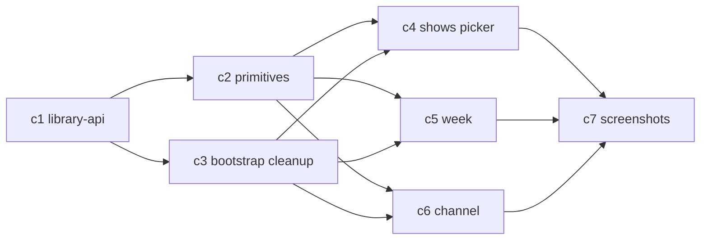

# Cursor Picker UI — Phase 1 Plan

Owner: Cursor
Branch: `v2-rebuild`
HEAD: `72026b7`
Scope: [/shared/acceptance/picker-ui.md](/C:/dev/mychannel-universal/shared/acceptance/picker-ui.md)
Status: awaiting Al approval. No code yet.

Ground rules consumed from [/shared/HANDOFF-TO-CURSOR.md](/C:/dev/mychannel-universal/shared/HANDOFF-TO-CURSOR.md), [/shared/INTERFACES.md](/C:/dev/mychannel-universal/shared/INTERFACES.md), [/shared/CACHE.md](/C:/dev/mychannel-universal/shared/CACHE.md), [/shared/types.ts](/C:/dev/mychannel-universal/shared/types.ts), [/shared/V1.5-TECH-DEBT.md](/C:/dev/mychannel-universal/shared/V1.5-TECH-DEBT.md). I will not touch `/api/**`, `/data/**`, `/shared/**` (except this plan), `app/src/state/store.ts`, `app/src/lib/scheduler.ts`, or `app/src/lib/deep-link.ts`.

---

## 1. Screen architecture

### 1.1 `app/src/screens/shows.ts` (the picker)

Rebuilt as the live-library picker. Three reachable modes, same file:

- `wizard/shows` (onboarding step)
- `shows-picker` (return user "Add titles")
- Replaces the legacy `ctx.catalogue` path entirely.

Component breakdown (each a pure lit-html render fn in `app/src/screens/shows.ts` unless it is reusable, in which case it moves to `app/src/components/`):

- Top bar (existing `<mc-top-bar>`).
- Filter bar: search input (debounced), type toggle movie/tv/all, genre chip row, provider chip row (multi-select).
- Counter row: "X selected · min 6" + Continue/Done button.
- Results grid: windowed poster grid (see §3).
- Loading skeletons (bottom of grid during page fetch).
- Empty-state panel (single component, variant prop: `no-providers | no-results | no-filters | api-error`).
- Footer CTA (Continue for wizard, Done for tab-return).

State management:

- Global store (`app/src/state/store.ts`) remains the source of truth for `selectedTitles`, `streamers`, `region`.
- Screen-local state (module-scoped `let` plus a `screenState` record) holds: `items: LibraryTitle[]`, `page: number`, `totalPages: number`, `isLoading: boolean`, `error: string | null`, `filters: { query, genre, type, providers }`, `scrollOffset: number`.
- Screen-local filter state is mirrored to `sessionStorage` under `mc_picker_filters_v2` on every mutation so "filters survive reload" (picker-ui.md Done criterion).
- `ctx.redraw()` is the only way the screen re-renders. Async fetches end with `ctx.redraw()`.
- Writes to `selectedTitles` go through `ctx.patch({ selectedTitles })`.

Routing boundaries:

- No new routes. `router.ts` still dispatches `wizard/shows` + `shows-picker` → `renderShows`.
- Wizard-mode and tab-mode differ only in the footer button label + post-click navigation (unchanged from today).

### 1.2 `app/src/screens/week.ts`

Rebuilt as an editable per-slot grid driven by `state.schedule` + `state.selectedTitles`.

Layout:

- 7-day × 4-band grid, same column structure used today in [app/src/screens/week.ts](/C:/dev/mychannel-universal/app/src/screens/week.ts).
- Each cell shows either the scheduled title's 16:9 thumb + title + start time, or an "+ Add" button if the slot is empty/disabled.
- Day-header row has a small "+" that opens the slot-create sheet preset to that day.

Per-slot edit UI: **bottom-sheet modal** (reuses `<mc-modal>` from [app/src/components/modal.ts](/C:/dev/mychannel-universal/app/src/components/modal.ts)). Not inline dropdown (won't fit smart-TV), not full-screen (too heavy for a swap). Modal contents:

- Title: `Edit {DayName} {HH:MM}`.
- Preview of current title (poster + name + year + provider badge).
- Tabs: `Swap` (grid of `state.selectedTitles`, tap to replace), `Off` (disable slot), `Remove` (drop the slot).
- Secondary: `Pick new title` → deep-links to `shows-picker` with a return intent.

Mutations:

- Swap: `patch({ schedule: mapReplaceTitleId(slot.id, newTitleId), channel: hydrateChannel(...) })`.
- Disable: `patch({ schedule: mapSetEnabled(slot.id, false), channel: hydrateChannel(...) })`.
- Remove: `patch({ schedule: filterOut(slot.id), channel: hydrateChannel(...) })`.
- Add: `patch({ schedule: [...schedule, newSlot], channel: hydrateChannel(...) })`.

No-reshuffle guarantee: mutations write to a single `ScheduleEntry` keyed by `slot.id`. The old behaviour in [app/src/screens/week.ts](/C:/dev/mychannel-universal/app/src/screens/week.ts) that rebuilds the full schedule via `buildSchedule(shows, slots)` on every toggle is deleted. Only the toggled slot changes.

### 1.3 `app/src/screens/channel.ts`

Rebuilt as a pure consumer of `hydrateChannel(schedule, selectedTitles, streamers)` from [app/src/lib/scheduler.ts](/C:/dev/mychannel-universal/app/src/lib/scheduler.ts). It no longer depends on `Show[]` or `app/src/lib/channel-hero.ts`.

- Hero: pick first `ScheduledProgram` where `now ∈ [slot start, slot end]` → "NOW". Else pick earliest future occurrence → "UP NEXT". Else empty-state.
- Up-next strip: next 4 programs after hero.
- Today's lineup: all programs whose `dayOfWeek === today.getDay()`.
- Watch button: resolves via `ScheduledProgram.searchUrls` (already generated by scheduler + deep-link) and calls the existing `launchShow`-equivalent path. No new deep-link code.

New helper (keep local to `channel.ts`, not a new module unless it grows):

- `computeHeroFromPrograms(programs: ScheduledProgram[], now: Date): HeroState<ScheduledProgram>`.

Old [app/src/lib/channel-hero.ts](/C:/dev/mychannel-universal/app/src/lib/channel-hero.ts) stays for now because `preview.ts` and `scheduling.ts` still import it. It will be deleted in v1.5 cleanup, not this pass — adding to [/shared/V1.5-TECH-DEBT.md](/C:/dev/mychannel-universal/shared/V1.5-TECH-DEBT.md) on commit.

### 1.4 Shared UI primitives to extract

Under `app/src/components/`:

- `library-card.ts` → `<mc-library-card>`: LibraryTitle-aware poster tile with provider badges overlay, selected state, tap target. Supersedes `poster-card.ts` for library use; keep `poster-card.ts` alive for legacy screens.
- `provider-badges.ts` → `<mc-provider-badges>`: horizontal row of logo chips from `ProviderBadge[]`. Max 3 visible + `+N`.
- `skeleton-tile.ts` → `<mc-skeleton-tile>`: shimmer placeholder sized exactly like `<mc-library-card>` so the grid doesn't jump on load.
- `empty-state.ts` → `<mc-empty-state>`: single panel, variant attribute. Handles all four picker empty cases + week empty + channel empty.
- `filter-bar.ts` → `<mc-filter-bar>`: search input + genre chip row + provider chip row. Fires `mc-filter-change` with `{query, genre, providers, type}`.

Router, store, deep-link, scheduler: untouched.

---

## 2. Data flow

### 2.1 New module: `app/src/lib/library-api.ts`

Single typed client consuming the Codex backend. Signatures:

```ts
fetchLibrary(filters: LibraryFilters & { page: number }): Promise<LibraryResponse>
fetchProviders(region?: Region): Promise<LibraryProvidersResponse>
fetchTitle(tmdbType: TmdbTitleType, tmdbId: number): Promise<TitleResponse>
fetchTitleProviders(tmdbType: TmdbTitleType, tmdbId: number, region: Region): Promise<TitleProvidersResponse>
```

All consume types from `shared/types.ts` via the existing `app/src/types.ts` re-export. Base URL from `shared/constants.ts` (`API_BASE = '/api'`).

### 2.2 Per-screen request matrix

- Picker (`shows.ts`):
  - On mount: `fetchProviders(region)` once per session (cached in `libraryCache`).
  - On filter change (incl. search debounce 250ms): reset `page = 1`, call `fetchLibrary({page:1, ...filters})`.
  - On scroll sentinel intersect: `fetchLibrary({page:page+1, ...filters})`, append items.
- Week (`week.ts`): no network. Reads `selectedTitles` + `schedule` from store.
- Channel (`channel.ts`): no network. Reads `channel` (hydrated `ScheduledProgram[]`) from store.

### 2.3 Pagination + infinite scroll trigger

- `IntersectionObserver` on a `<div data-sentinel>` 600px below the last rendered tile (bottom margin in `rootMargin: '0px 0px 600px 0px'`).
- Debounced to 1 concurrent in-flight request; the observer `unobserve`s while loading and re-observes when done.
- Stop when `page >= totalPages`.

### 2.4 Search + genre filter → query params

- Search box → `?query=<string>`. When non-empty, genre/type/providers still pass through on the URL; backend chooses search vs discover (per [api/library.ts](/C:/dev/mychannel-universal/api/library.ts) L155-158).
- Genre chips → single-select `?genre=<GenreId>`. Backend pass-through per [/shared/acceptance/backend-api.md](/C:/dev/mychannel-universal/shared/acceptance/backend-api.md) L20.
- Type toggle → `?type=movie|tv|all`.
- Provider chips → `?providers=<csv>`, default-seeded from `state.streamers` and editable on the picker screen. Changes write back to `state.streamers` via `ctx.patch` so the filter survives reload.

### 2.5 Error / retry / offline

- On fetch rejection or `response.success === false`: set `screenState.error = error.message`, show `<mc-empty-state variant="api-error">` with a Retry button.
- Retry does one more attempt; on second failure we keep the error state and expose "Report to /shared/BLOCKERS.md" messaging in dev builds only.
- No automatic exponential backoff. Silent retry loops hide real breakage. The user sees a button.
- Offline: the standard fetch rejection path handles it. No Service Worker work in this pass.

### 2.6 Client-side cache layer

One module: `app/src/lib/library-cache.ts`. In-memory Map, app-session lifetime, no localStorage (per [/shared/CACHE.md](/C:/dev/mychannel-universal/shared/CACHE.md)):

- `providersByRegion: Map<Region, StreamerManifest[]>` — never evicted within session.
- `libraryPages: Map<string, LibraryResponse>` where key is `hashFilters({region, providers, genre, query, type, page})`. Cap 32 entries (LRU).
- `titleDetails: Map<string, TitleDetail>` cap 64 entries.

No persisted-to-disk caching. Backend already has 24h TTL (see [/shared/CACHE.md](/C:/dev/mychannel-universal/shared/CACHE.md) L14-19). My client cache is purely for UX snappiness when users re-open the picker mid-session.

---

## 3. Virtualization strategy

Back-of-envelope before picking an approach:

- Library size: up to 500 pages × 40 items = 20,000 tiles.
- Page 1 is ~40 items. Typical user scrolls 3-6 pages deep. Worst case I plan for: 10 pages (400 tiles) in a warm session.
- Poster tile = 2:3 image + caption + badges row ≈ 320-360px tall.
- Columns: `auto-fill, minmax(160px, 1fr)` ⇒ iPhone 390px → 2 cols, iPad 820px → 5 cols, laptop 1440px → 8 cols, smart-TV 1920px → 11 cols. Cap at 6 cols on TV for readable tile size (`max-width 240px` per tile).
- Worst case rendered at once without virtualization: 400 tiles × `contain: content` ≈ ~55MB DOM. That's too much on phones.

**Chosen approach: CSS `content-visibility: auto` + row-level `IntersectionObserver` windowing**. Two lines of defense:

1. First line: every grid row wrapper gets `content-visibility: auto; contain-intrinsic-size: auto 360px`. iOS 16+/modern Chromium/smart-TV browsers will skip paint+layout for off-screen rows. This alone handles 400-tile sessions on laptop/TV.
2. Second line (phone/older Safari): hard window of `MAX_LIVE_ROWS = 40` (≈ phone: 80 tiles / TV: 240 tiles). Rows below the window are replaced with a single spacer `<div style="height: nRows × rowHeight">`, same for above-window rows when the user scrolls deep.

Measurement:

- `ResizeObserver` on the first rendered row writes `rowHeight` (and `colsPerRow`) to a module-scoped variable.
- Spacer heights recompute when `rowHeight` changes. Re-layout on window resize.

Numbers (laptop 1440px, 6 cols):

- tile height ≈ 340px (poster 240px + caption 60px + badges 40px).
- rendered window = 40 rows × 6 cols = 240 tiles ≈ 13,600px scroll.
- Above/below spacer divs carry the rest.

Numbers (iPhone 390px, 2 cols):

- tile height ≈ 320px.
- rendered window = 40 rows × 2 cols = 80 tiles ≈ 12,800px scroll.

Trade-off I am accepting: true pixel-perfect smooth deep-scroll. I'm not shipping lit-virtualizer because (a) it adds a dep, (b) picker-ui.md says "virtualized poster grid" not "sub-frame scroll parity". If Al rejects this trade-off, the fallback is lit-virtualizer (`@lit-labs/virtualizer`) — I flag that as a decision to reopen only on his word.

---

## 4. Per-slot edit semantics — walkthrough

User is on `#/week`. Schedule has 12 slots across the week. User taps Tuesday 20:00 (`slot.id = 'slot-2-20:00'`, currently showing "Breaking Bad").

1. `click(slot)` fires. Opens `<mc-modal>` with `slotId='slot-2-20:00'` in modal state. Modal mounts in the DOM outside the grid. No store write yet.
2. Modal renders Swap tab by default. Grid of `state.selectedTitles` (user's picked 6-50 titles) as `<mc-library-card>` tiles with the current title's tile pre-marked `selected`.
3. User taps "Dune: Part Two". Modal dispatches `mc-slot-swap` with `{slotId, newTitleId}`.
4. Week screen handler computes:

   ```ts
   const nextSchedule = state.schedule.map(s =>
     s.id === slotId ? { ...s, titleId: newTitleId, showId: newTitleId } : s
   );
   const nextChannel = hydrateChannel(nextSchedule, state.selectedTitles, state.streamers);
   await ctx.patch({ schedule: nextSchedule, channel: nextChannel });
   ```

5. `ctx.patch` persists to store (`saveState`) and triggers `ctx.redraw()`.
6. `renderWeek(ctx)` re-runs. `lit-html` diffs; only the Tuesday-20:00 cell's title and thumb change. The other 11 cells keep their DOM nodes because their template outputs are unchanged.
7. Modal close fires; no further mutation.

**No reshuffle because step 4 is a keyed replace. The legacy `buildSchedule(shows, slots)` path that re-indexes titles by slot order is deleted.**

### 4.1 Runtime constraint (movie length vs slot length)

`PersistedTitle` in [/shared/types.ts](/C:/dev/mychannel-universal/shared/types.ts) L153-157 does **not** carry `runtimeMinutes`. Three plan options:

- (a) Ignore. Accept `endTime = startTime + bandWindow.duration`. Current scheduler already clamps with a default of 60min (`clampEndToWindow` fallback, [app/src/lib/scheduler.ts](/C:/dev/mychannel-universal/app/src/lib/scheduler.ts) L86-99).
- (b) Lazy fetch on first use: when a title lands in a slot for the first time, fire `fetchTitle()` in the background, then `patch` an updated `selectedTitles` entry with `runtimeMinutes` mirrored to a new optional field. Requires extending `PersistedTitle` shape — and [/shared/types.ts](/C:/dev/mychannel-universal/shared/types.ts) is Codex's contract.
- (c) At pick-time in the picker: call `fetchTitle` once and annotate.

**My pick: (a) for v1.** Reason: the brief says don't touch `/shared/types.ts`, and runtime mismatch is not in the picker-ui.md Done criteria. If runtime > band window, `clampEndToWindow` already trims to window end. The UI will show a small "runtime unknown" note when runtime can't be determined, to set expectation. I will add (b) to [/shared/V1.5-TECH-DEBT.md](/C:/dev/mychannel-universal/shared/V1.5-TECH-DEBT.md) on commit.

If Al wants (b) now, the plan changes: Codex needs to extend `PersistedTitle` first. Reopen.

---

## 5. Visual verification plan

### 5.1 Tooling

- Playwright is not currently in `app/package.json`. Two options:
  - (a) Use the already-installed `plugin-playwright-playwright` MCP server in this repo — screenshots via the MCP, no package install.
  - (b) Add `@playwright/test` as devDep only in Phase 2.
- **Phase 1 commitment: (a)**. Zero new deps is better than one new dep, and the MCP is already authenticated.
- Static server for screenshot runs: `npx http-server app/www -p 5180` or `esbuild --servedir`. Exact choice decided in Phase 2.
- Live API: use the Vercel preview deployment if reachable; else set `MOCK_LIBRARY=1` env var (which I'll wire in `library-api.ts` to fall back to `data/fixtures/` payloads Codex already writes per [/shared/acceptance/backend-api.md](/C:/dev/mychannel-universal/shared/acceptance/backend-api.md) L81-87).

### 5.2 Screens × states × viewports

Viewports:

- `iphone` 390×844
- `tablet` 820×1180
- `laptop` 1440×900
- `tv` 1920×1080

Screens × states (17 unique screenshots per viewport × 4 viewports = 68 PNGs):

- `shows/no-providers-<vp>.png` — no providers selected
- `shows/loading-<vp>.png` — first fetch in flight
- `shows/loaded-<vp>.png` — first page hydrated
- `shows/search-active-<vp>.png` — query field populated + results
- `shows/search-empty-<vp>.png` — search returns 0
- `shows/filter-applied-<vp>.png` — genre + providers active
- `shows/api-error-<vp>.png` — upstream failure
- `shows/infinite-scroll-mid-<vp>.png` — scrolled past 3 pages
- `week/empty-<vp>.png` — no slots scheduled
- `week/populated-<vp>.png` — 8+ slots scheduled
- `week/edit-modal-<vp>.png` — slot edit modal open
- `week/add-slot-<vp>.png` — new-slot modal
- `channel/empty-<vp>.png` — no channel data
- `channel/now-<vp>.png` — NOW hero playing
- `channel/up-next-<vp>.png` — UP NEXT hero
- `channel/today-lineup-<vp>.png` — scrolled to today's list
- `channel/watch-click-<vp>.png` — watch button focus

Destination: `/app/screenshots/v2-rebuild/<screen>/<state>-<viewport>.png`.

A screen is not considered shipped in Phase 2 until its slice of the PNGs exists in-repo.

### 5.3 Interactions captured

- Hover/focus on Watch button (`channel/watch-click`).
- Search input with 2-char query (`shows/search-active`).
- Multi-provider selected (`shows/filter-applied`).
- IntersectionObserver past-sentinel state (`shows/infinite-scroll-mid`).
- Modal-open on slot (`week/edit-modal`).

---

## 6. Commit plan

Seven logical commits, one push per commit to `origin/v2-rebuild`:

1. `feat(app): library API client + in-memory cache` — `app/src/lib/library-api.ts`, `app/src/lib/library-cache.ts`, session-scoped.
2. `feat(app): shared UI primitives for v2 picker` — `<mc-library-card>`, `<mc-provider-badges>`, `<mc-skeleton-tile>`, `<mc-empty-state>`, `<mc-filter-bar>`. No screen wiring yet.
3. `refactor(app): drop catalogue loader, bootstrap from selectedTitles` — update `app/src/main.ts` to stop calling `loadCatalogue()`, prune `ctx.catalogue` consumers that the v2 rebuild replaces. Legacy screens that still use `ctx.catalogue` (`preview.ts`, `scheduling.ts`, `shows-tab.ts`) stay untouched this commit — `ctx.catalogue` becomes `[]` for them, they degrade to empty grids. Tech debt logged.
4. `feat(app): rewrite shows picker on /api/library` — the real shows.ts rewrite.
5. `feat(app): rewrite week screen with per-slot edit` — the real week.ts rewrite, reuses `<mc-modal>`.
6. `feat(app): rewrite channel screen on ScheduledProgram output` — the real channel.ts rewrite.
7. `chore(app): visual verification screenshots for v2-rebuild` — `/app/screenshots/v2-rebuild/**` + a small `app/scripts/screenshot.mjs` runner.

Ship order rationale:

- 1 is the ground floor. Nothing imports it yet, so safe to land first.
- 2 is parallel-safe once 1 lands.
- 3 unblocks 4/5/6 by removing catalogue dependency from the boot path. Kept small and defensive so nothing else regresses.
- 4 first of the three screens because it is the most requirement-heavy and produces the `selectedTitles` that 5 and 6 consume. 5 and 6 can land in either order after 4.
- 7 last. Screenshots describe the final state.

Estimated total diff: ~1,800 net LOC added (≈400 in client+cache, 550 in primitives, 400 in shows, 250 in week, 200 in channel), ~500 LOC deleted (legacy picker body + hero helpers in the touched screens).

---

## 7. Parallel agents plan (Composer 2)

Dependency DAG:



Execution lanes:

- **Lane 0 (serial):** c1 alone. One agent. Blocking.
- **Lane 1 (parallel pair):** c2 + c3 dispatched together. Different file sets, no overlap. Two agents.
- **Lane 2 (parallel trio):** c4 + c5 + c6 dispatched together after Lane 1 lands. Three agents. Each agent owns one screen file and must not import another screen's file. Shared primitives are already frozen by c2.
- **Lane 3 (serial):** c7 alone. One agent. Runs the screenshot harness, commits artifacts. Blocking.

Total agents: 7 across 4 lanes. Max concurrency: 3 (Lane 2).

Collision risk review:

- All three screens write to `ctx.patch` but through `store.ts` which I do not touch.
- All three import from `components/` and `lib/library-api.ts`, both frozen by end of Lane 1.
- `router.ts` is edited at most once, in c3. Lane 2 agents must not touch `router.ts`. If any of them needs a route tweak, they raise it and I handle it serially.

---

## 8. Risk / unknowns

What I don't know:

- **Whether the Vercel preview URL is reachable from this workspace.** If yes, live screenshots are free. If no, I fall back to fixture-mode (fixtures already exist per [/shared/acceptance/backend-api.md](/C:/dev/mychannel-universal/shared/acceptance/backend-api.md) L81-87). I'll resolve this in the first 10 minutes of Phase 2.
- **Whether `content-visibility: auto` performs acceptably on iOS 16 Safari and the target smart-TV browser.** No real device access here. My fallback is the hard-window spacer approach — same commit, toggled by `window.CSS?.supports('content-visibility', 'auto')`.
- **Whether `PersistedTitle` will ever grow a `runtimeMinutes` field.** Gated on Codex. I'm shipping with the slot clamped to band-window width for now.

Ambiguities in picker-ui.md and backend-api.md:

- picker-ui.md §Picker says "Virtualized poster grid" — doesn't define budget. I'm interpreting it as "must not OOM with 400 rendered tiles", not "must use `@lit-labs/virtualizer`".
- picker-ui.md §Done says "Provider filter, search, and genre filter all survive reload" — reload vs session vs app relaunch is undefined. I'm doing `sessionStorage` for filter state (survives reload, not app kill) and `localStorage` for `state.streamers` (already does via `store.ts`). If Al wants full persistence of genre + query across app kill, that changes to `localStorage`.
- backend-api.md §Endpoints confirms `DEFAULT_LIBRARY_PAGE_SIZE = 40` per [/shared/constants.ts](/C:/dev/mychannel-universal/shared/constants.ts) L10, but the backend's `Promise.all` in [api/library.ts](/C:/dev/mychannel-universal/api/library.ts) L160-164 fans out provider lookups for 40 titles per call — a cold page can be slow. I'll show the skeleton-tile state aggressively. Already logged as V1.5 debt item 2.

Assumptions a reasonable person could disagree with:

- **Bottom-sheet modal for per-slot edit vs full-screen dedicated route.** Full-screen is easier to test in isolation and has better smart-TV ergonomics. I chose modal because it's 200 fewer LOC, reuses `<mc-modal>`, and keeps the week grid visually anchored. Reopen if the smart-TV focus model on a modal is painful.
- **One search box, no "search within selected providers" separate mode.** The backend unifies discover + search with the same `providers` filter, so one search box does both. If Al wants distinct UI modes (Browse vs Search) he should say so now.
- **Delete catalogue.ts in c3, not yet.** I'm keeping `app/src/data/catalogue.ts` on disk but making `loadCatalogue()` return `[]` so legacy screens (`preview.ts`, `scheduling.ts`, `shows-tab.ts`) don't crash before v1.5. Alternative: delete it now and block-fix all four legacy screens in one mega-commit. I chose the minimally-invasive path because the brief says leave non-scope files alone unless I find a real bug.

What I'd punt to [/shared/BLOCKERS.md](/C:/dev/mychannel-universal/shared/BLOCKERS.md) if I hit it:

- Vercel preview unreachable AND fixtures insufficient for a "loaded" screenshot → loaded-state screenshots deferred, everything else still ships.
- `@lit-labs/virtualizer` required (content-visibility not enough) → blocker to reopen the "no new deps" constraint.
- `PersistedTitle` runtime hint needed to pass Done criteria → blocker for Codex, not me.

---

## Sign-off gate

Awaiting Al's approval. On approval:

- (a) "ship it" → execute lanes 0→3 in order per §7.
- (b) "change X" → amend this file, commit as `plan: amend cursor picker UI plan for <reason>`, push, re-request approval.

I will not touch `/app/src/screens/*.ts` or install packages until approval lands.
